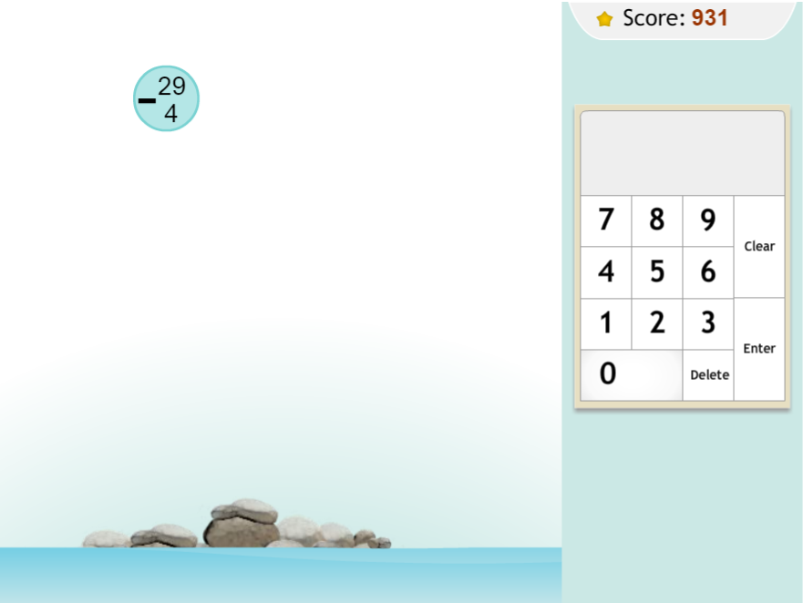

моя работа https://enigmer2.github.io/raindrops/

# raindrops

## Задание

Вам необходимо создать приложение - тренажёр по математике, позволяющий закрепить навыки арифметических действий: сложения, вычитания, умножения и деления.

Условие задачи написано в капле дождя, которая падает с определенной скоростью. Ответ вводится на панели с цифрами. Необходимо успеть ввести ответ до того, как капля упадёт.

Скриншот приложения

- [Видеообзор игры](https://youtu.be/YDzeM8R4d24)
- [Demo](https://www.to14.com/game.php?id=4d486a66950d8#)
Для просмотра игры нужно разрешить flash player

*В оформление игры можно вносить свои изменения с целью его улучшения*

## Технические требования

- приложение корректно работает в последней версии Chrome
- можно использовать css-препроцессоры, css-фреймворки: bootstrap, material design и др.
- использование jQuery в основном коде приложения не допускается

## Работа приложения

- [ ] на стартовом экране игры есть кнопки 'Play' и 'How to play'
- [ ] при клике по кнопке 'How to play' игра запускается в автоматическом режиме
- [ ] клик по кнопке 'Play' запускает игру
- [X] в левой части игрового поля, оформленного как морской пейзаж,
- [ ] падают капли дождя. 
- [ ] Внутри каждой капли - математическое выражение
- [X] в правой части игрового поля находится блок с цифрами и клавишами Enter, Delete, Clear. 
- [ ] Вверху выводится счёт игры
- [ ] если игрок правильно решил математическое выражение и успел ввести ответ до того, как капля упала в море, его счёт увеличивается
- [ ] если игрок не успел ввести ответ, его счёт уменьшается, уровень моря поднимается.
- [ ] После трёх проигрышей игра заканчивается, выводится счёт и статистика игры
- [ ] правильные и неправильные ответы сопровождаются звуковыми сигналами и анимацией. Также есть фоновый звук и анимация волн

## Критерии оценки:

**Максимальный балл за задание: 180 баллов**

### Basic scope +70
- вёрстка, дизайн, UI **30 баллов**
  - [ ] минимальная ширина страницы, при которой приложение отображается корректно – 320 рх +10
  - [X] внешний вид приложения внешне соответствует макету или является его улучшенной версией +10
  - [X] есть фоновый звук и анимация волн +10
- базовый механизм игры **40 баллов**
  - [ ] в ходе игры математические выражения генерируются случайным образом +10
  - [ ] есть панель с цифрами при помощи которой можно ввести ответ +10
  - [ ] приложение различает правильные и неправильные ответы +10 
  - [ ] после окончания игры выводится набранное количество баллов +10

### Advanced scope +80
- продвинутый механизм игры **40 баллов**
  - [ ] при клике по кнопке 'How to play' игра запускается в автоматическом режиме +10
  - [ ] в ходе игры происходит постепенное усложнение математических выражений +10
  - [ ] в ходе игры скорость падения капель постепенно увеличивается +10
  - [ ] правильные и неправильные ответы сопровождаются звуковыми сигналами и анимацией +10
  - [ ] счёт игры увеличивается по нарастающей - 10 баллов за первый правильный, каждый следующий ответ приносит на один балл больше, чем предыдуший +10
  - [ ] иногда выпадают бонусные капли другого цвета, решение выражений в которых полностью очищает игровое поле от других капель +10
  - [ ] набирать и вводить ответ можно не только кликая мышкой, но и при помощи клавиатуры +10
  - [ ] после окончания игры выводится счёт и статистика игры +10

### Hacker scope +50
- дополнительные возможности
  - [X] приложение можно развернуть на весь экран +10
  - [ ] можно указать какие математические действия отрабатываются и с какими числами +10
  - [ ] продуман и реализован не предусмотренный заданием дополнительный функционал (например отключить звуки) +10
  - [ ] дополнительно нужно реализовать возможность, которой нет в оригинальном приложении - указать какие математические действия отрабатываются с какими числами. +10
  - [ ] дополнительно нужно реализовать возможность, которой нет в оригинальном приложении - деление на два или сложение в пределах десяти. +10
